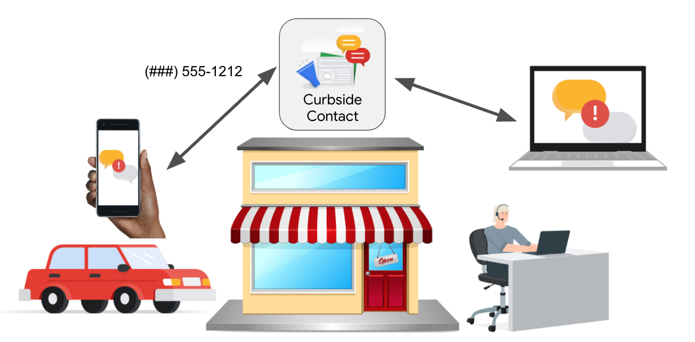

# Curbside Contact

Curbside Contact is a web application allowing business to interact with customers via SMS for the purposes of coordinating services when:

*   a customer is not able to come inside the building (during Covid19, maybe beyond)
*   the business wants an asynchronous way for many customers to be able to attend to this need, without further clogging what might be busy phone lines.

See more overview in [this presentation](https://docs.google.com/presentation/d/e/2PACX-1vRMEaFPfyFg2QjoLPXyQUOqPC4vdJvFM0MXoKYcwoK7Uc579TwFLeLtyIE69dX0meHfz1FqAta5-ZFr/pub?start=false&loop=false&delayms=3000)

This application is designed for small businesses of all types. The software is designed to be set up by an SMB IT consulting and is designed to be multi-tenant. No coding skills are required.
One instance of the system can support multiple businesses. The cloud infrastructure is completely serverless and fully mangaged. SMS fees represent the main cost of this system.

### Documentation

If you are an employee at a business using the Curbside solution, you are likely looking for the [User Guide](docs/userguide.md).

If you are looking to configure the behavior of the application, such as setting statuses, see the [Admin user guide](docs/admin-user.md).

If you are looking to set up an instance of Curbside, or configure new numbers, see the [System Admin guide](docs/admin-system.md)

The admin guide also has details on the [solution architecture](https://github.com/ptone/curbside/blob/main/docs/admin-system.md#architecture-and-security).

--- 

This is not an official Google project.

See [LICENSE](LICENSE.md).
