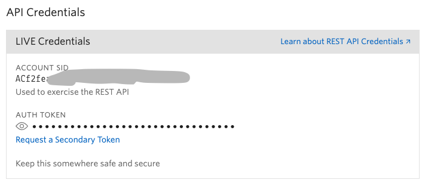
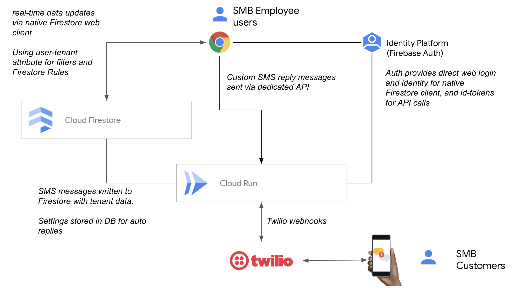

# Curbside Contact setup and admin guide
## Installation

### Prerequisites

- Create a Google Cloud Project in the [Cloud Console](https://console.cloud.google.com/)
  - It is strongly recommended you create a new Google Cloud Project for this app, instead of attempting to add it to an existing one.
- Open or login to a [Twilio Account](https://www.twilio.com/)
- Open the [Twilio console](https://www.twilio.com/console/project/settings) and note Account SID and Auth Token

The remainder of this install process is done from inside the built in Cloud Shell environment of the Google Cloud Console, click the following:

Note: You will need to trust this repo when prompted for install to proceed.

## Administrative tasks

Please note, this solution is provided as-is with no official support.

Bugs, technical defects, and feature requests can be reported through [Github issues](https://github.com/ptone/curbside/issues) on this repo.

For community based support, please use this [Google Group](https://groups.google.com/g/curbside-contact-dev).

### Adding additional tenants

A tenant is going to be any unique business + location. If a business has multiple physical location, each location will be its own tenant in the system.  Each tenant will have a dedicated SMS number.

For each new tenant, you must acquire a new SMS number in Twilio, and configure it to use the existing messaging app as outlined in the [install guide](./install-complete.md).

These steps assume you are still working in the Cloud Shell of the Google console. However you may need to re-initialize the environment. If you saved your configuration per the last step of the install guide, you can enter:

    source env.prod.bash

For setting tenant, you really only need one setting, and you can also enter only:

    export GOOGLE_CLOUD_PROJECT=[your-project-id]

Using the email of the point of contact, you can now enter a new first user for the tenant:

    python3 set_tenant.py -e fake2@example.com -n "+1__________"

You can optionally set your own `--password` if you don't want one generated.

Share the new login with the user through a secure channel

### Add user to existing tenant

While it is common to have a single user for a tenant as a shared login on multi-user workstations, a tenant can have more than one user. This is useful because the alert settings are per user. So a tenant may have one user for front office staff, with low alert settings - and a different user for large big-board touch-screen in a back office location.

To add an additional user, add the `--no-bootstrap` option, otherwise the tenant will be re-initialized.

    python3 set_tenant.py --no-bootstrap -e fake2@example.com -n "+1__________"

### Associate an existing user with a tenant

A user can only be associated with one tenant. An existing user can be associated with a specific tenant using the following command. You will need the UID of the user from the Firebase user/auth console.

    python3 set_tenant.py --no-bootstrap -u xxyyzz -n "+1__________"

### Removing tenant

There is not particular automation for removing a single tenant or data from the system. You can release a number in Twilio, and delete the user in Firebase Auth console.

See notes about deleting and shutting down below.

### Using a custom domain

You can easily map a custom domain with the instance of your service. You will need to verify you manage the domain with Google, and have access to DNS for the domain.

You do not have to update the message service settings in Twilio after mapping the domain, it will continue to work with the run.app based URL.

You can associate multiple domains with the same service. For example if you wanted to provide a vanity host per tenant.

Please see the instructions here:

https://cloud.google.com/run/docs/mapping-custom-domains

### Disable CNAM

By default, the system uses Twilio's caller ID [CNAM feature](https://support.twilio.com/hc/en-us/articles/360051670533-Getting-Started-with-CNAM-Caller-ID). This can add additional costs to operating the system and may not be useful to your tenant types.

There is currently no way to enable/disable this per tenant, and disabling requires greater technical familiarity with the system.

Do disable the service, you must deploy a new revision from [this page](https://console.cloud.google.com/run/detail/us-central1/app/revisions)

Add a new Variable with a `Name` of `DISABLE_CNAM` and a value of `true`

Deploy this revision.

### Upgrade

This will be documented as the solution is updated and upgrades are available.
## Architecture and Security

The system is built on the fully managed services of [Google Cloud Platform](https://cloud.google.com) and messaging services of [Twilio](https://twilio.com) and is fully serverless.

All webhook calls to the service are validated as being signed by Twilio.

User credentials are managed in [Firebase Auth](https://firebase.google.com/products/auth). Firebase auth is used to directly authenticate users to the [Firestore database](https://cloud.google.com/firestore) for real-time display.

This direct database connection is governed by [Firebase Security rules](https://firebase.google.com/docs/rules) (See file in this repo `firestore.rules`).

 This authentication service is also used to generate id-tokens from the browser when communicating with APIs hosted in [Cloud Run](https://cloud.run). These id tokens, include a Google signed claim of the User's associated tenant-id, which is the Twilio SMS number associated with the tenant, creating a secure boundary for tenants.

 Employees at tenants should be trained that like any system, this contains sensitive customer PII in the form of phone numbers. This should be treated like any other IT system at the business subject to employee access and abuse related to customer management. It should not be used to send or receive payment credentials such as credit card numbers.

## Cost

Cost will **heavily** depend on the specific usage patterns of the tenants. Is this a once a day dinner rush, all day retail pickup, etc.

To provide some reference data: This solution has been piloted for 16 Veterinary clinics, spread across all US timezones, with relatively steady use across business hours. The Twilio fees have averaged approximately $500 per month (with about $100 of that being CNAM lookups), and the Google Cloud bill has been less than $10 per month.
## Deletion and Shutdown

There is no mechanism provided to remove data for a specific tenant without direct knowledge and skills in Firestore database.  However storage costs are relatively low if the tenant is not active.

A tenant number can be [released](https://support.twilio.com/hc/en-us/articles/223183028-Cancel-or-release-a-Twilio-number) in Twilio to de-activate it.

To [shutdown](https://cloud.google.com/resource-manager/docs/creating-managing-projects#shutting_down_projects) the entire system for all tenants, shutdown the Google project created for curbside.

