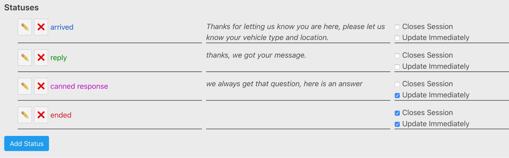

# Admin Users

Mostly TODO:

## Structure of Curbside System

Curbside Contact is cloud based software consisting of a hierarchy of systems and roles.

The structure is:

*   Software sources and repositories - development of code, releases of versions
    *   System instances - a running occurence of a specific version of Curbside Contact
        *   System Admin - creates tenants and registers numbers
        *   Tenant - a specific phone number that end users contact and associated sessions and settings
            *   Tenant User - A specific login to the web application
                *   Tenant System  - the computer and browser where a Tenant user Logs in.

Currently there is no specific Tenant admin role, a Tenant user has full power to manage tenant settings

This documentation is for the admin tasks of a Tenant - documentation for a system admin in development.

The Tenant settings are divided between those for the Tenant, and those for a Tenant User

Currently most Tenants have one User.

To access these settings, click the gear icon, not all savings are automatically saved as soon as they are changed.

## Tenant User settings

The tenant user settings primarily relate to the sound and notification settings, some of which may require further action for each computer you log in to. This way you may have one login with certain notification settings in a back of house location, and another login with no sounds in an office.

### Sound settings

There are three sounds that can be applied at different points in the lifecycle of a conversation:

*   A doorbell sound
*   a counter bell "ding" sound
*   A spoken alert "A curbside customer needs attention"

By default these are set to the following events:

*   on arrival: doorbell
*   on customer reply: ding
*   on overdue: alert

### Overdue deadline

This configures how many seconds the team has to reply to a customer arrival or new reply. If the team has not interacted with the conversation in a way that has sent some message to the customer by this many seconds, the conversation goes "overdue" (described above).

## Tenant settings

### Do Not Disturb

When the business is not operating, customers who mistakenly send a message to the number should not get the standard arrived reply, and a session should not be created. When DND is enabled, a DND reply is sent, and no session is created.

**DND On/Off** - is the Do Not Disturb (aka out of office) setting on or off. Set this to "ON" when you are closed and you want to enable DND.

**DND Message** - is the auto-reply, letting the customer know the business is closed and redirecting them to alternate services or a website.

# Status Settings

As noted in the user section above, a conversation can be in any number of current "status" or state. These can be configured to create any number of custom states, but must include the following required, standard status options (currently - these must remain as lower case):

*   arrived
*   reply
*   ended

### Examples

*   You can create a set of internal notes with an "internal" status, with no response, and "update immediately" enabled. This will record any internal note to the conversation without sending anything to the customer.
*   Canned responses: any status with a response message configured and "update immediately" will quickly send a canned question or common reply to the customer.

## Creating New Status

Click the "Add Status" button below the list of settings to add a new setting.

You can configure the label, any response, and whether that response is sent immediately - and whether choosing this status closes the conversation.

## Editing Existing Status

Click the pencil icon to the left of a status to edit it's settings.

## Deleting Status

Clicking the 'x' button to the left of a status deletes it immediately with no confirmation, and can not be undone.

