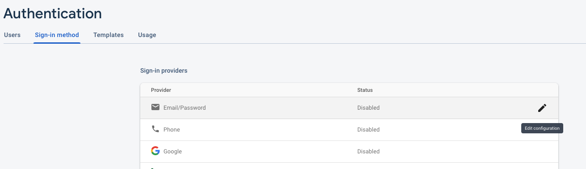
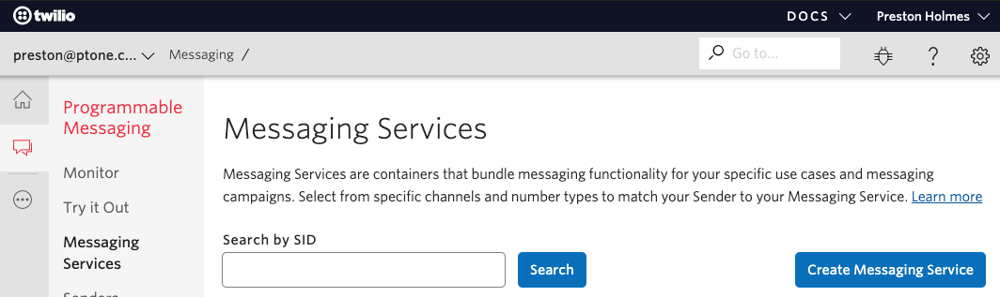
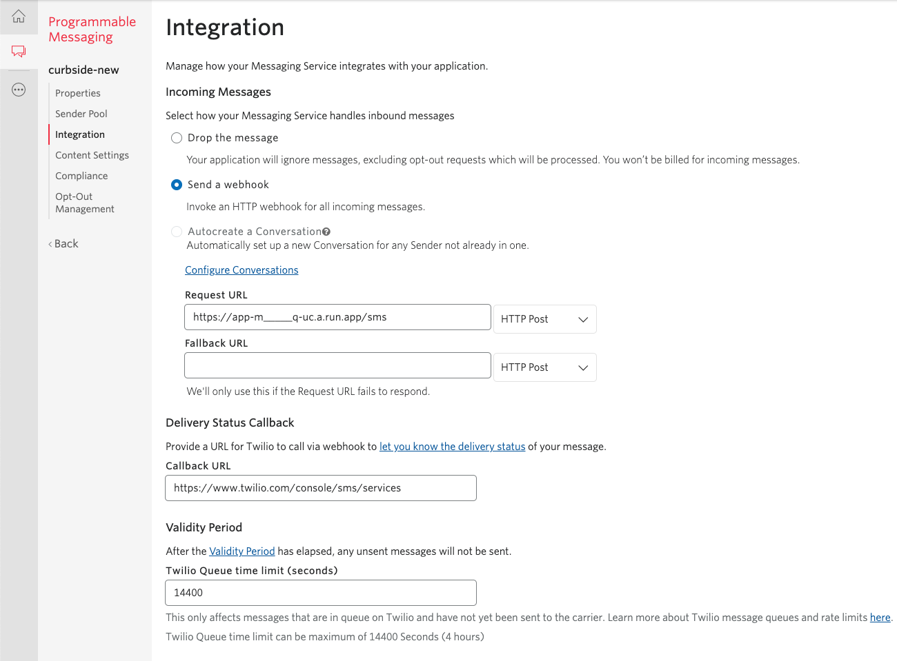
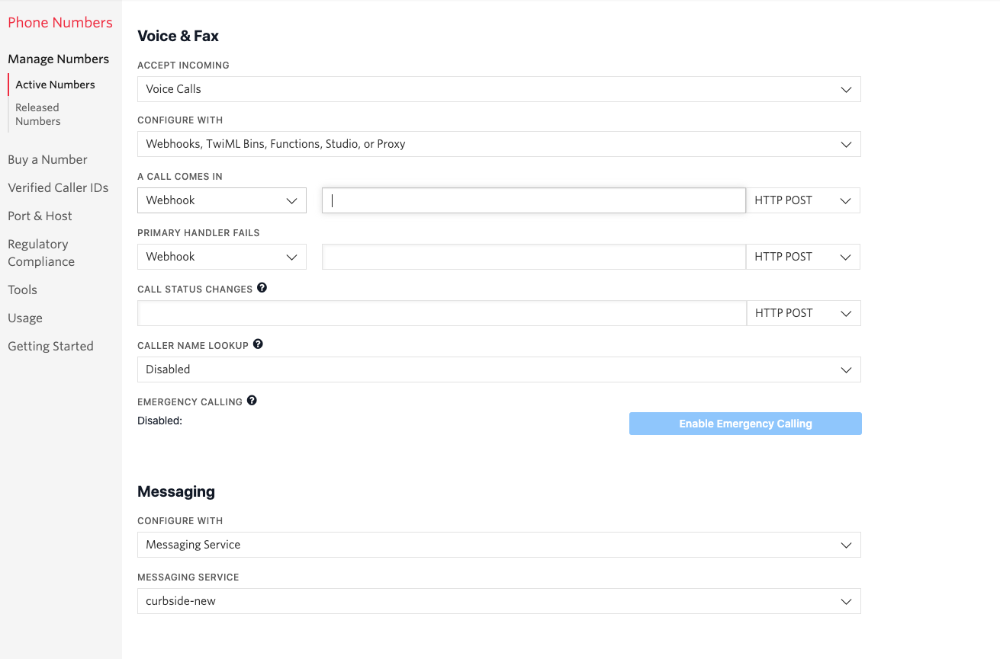

# Install Complete

Congrats, part one of the system has been installed. Here is what remains:

- Configure user logins in Firebase
- Set up Twilio SMS app and numbers
- Configure Tenants and Users for these numbers

There should be two URLs in the terminal part of Cloud Shell, they should be clickable.

### Setting Up Firebase Auth
The first is to the auth section of the Firebase Console. Opening that should you bring to a screen where you can click the "Get Started" button, and then enable providers.

Here you want to enable the email/password provider.

You can then close this Firebase console tab.

In the small business environment where this solution is used, it is common to have shared workstations where applications are logged into once, then shared among users.

The email you assign to users can be considered a username, and does not need to receive any email. Currently the application does not support any password recovery by email, so it is only the system-admin that sets and refreshes passwords.

There are a couple preparation steps. This particular task requires a different type of authentication. Enter this command, then follow the generated link to login and get the auth code to paste back in the terminal:

    gcloud auth application-default login -q

Second - the database may not respond to writes until it has been opened once, so visit the database page <a href="https://console.cloud.google.com/firestore/data" target="_blank">here</a>

Next, in the terminal, enter the following command to create a dummy users to try the login:

    python3 set_tenant.py -e fake@example.com -n "+12223334444"

Note that the email and number doesn't need to be valid. The number must be in this format however.

Grab the generated password (in the future, you will share this back to your tenant users).

Now click the second URL output from the install script that ends in `run.app`

If you no longer see this URL, you can get it by running:

    gcloud run services describe app --platform managed --region us-central1 --format='value(status.url)'

You should be able to login to the site using `fake@example.com` and the generated password.

### Getting a Twilio number and setting up SMS app

You want to create a Twilio messaging service here https://www.twilio.com/console/sms/services

The "senders" will represent the numbers you associate with this service. You will set up one number per business/location. The Twilio number is considered the "tenant" id for the curbside system.

But first, you will configure the webhook integration:

You want to choose webhook for incomming messages, then use the URL for the app, but **important** you must add `/sms` to the end of the URL.

Save this, and then from the Sender Pool section of your service, you will now buy a new number to associate with this service.

On the number management and configuration screen you should do the following:

- delete the URL for a webhook - this will disable any voice handling for this number
- Choose to configure with a Messaging Service
- Choose the messaging service you created in the previous step

Note the number in the format of `+12223334444`

Now create a tenant/user for this number

    python3 set_tenant.py -e fake2@example.com -n "+1__________"
  
Note that you can only have a given user associated with one number, but you can have multiple users associated with a single number. However a current limit of the provisioning script is it will also write defaults for the status types for that tenant.

You can now login with this user, and then try sending an SMS msg to the Twilio number and you should see a live response in the web UI.

From this point, see the admin and user-guide ([user](userguide.md) [admin](admin-user.md)) for the behavior of the application.

### Adding additional tenants

You can buy additional numbers, and associate with the existing messaging app.

You can then add the initial user for each new number.