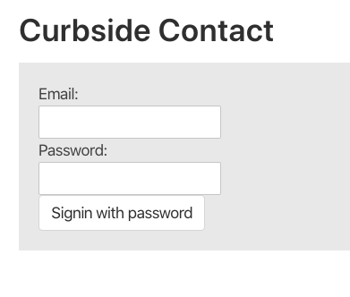
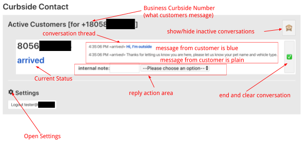
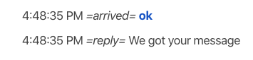
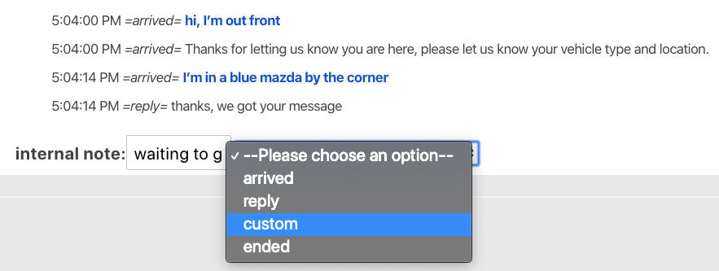
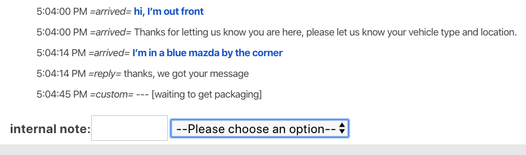
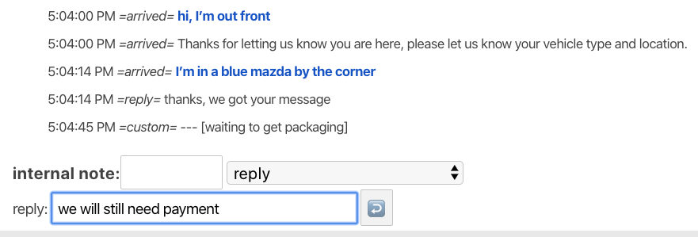
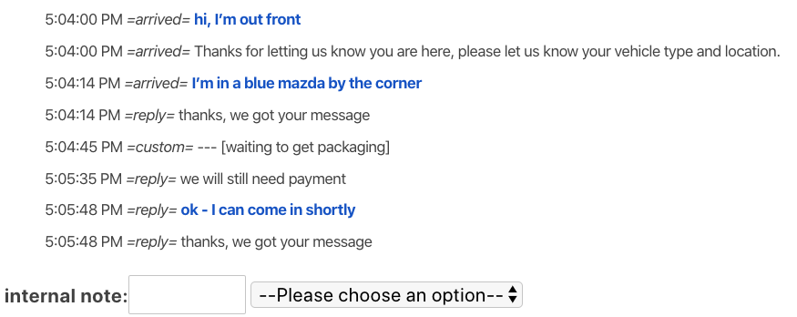
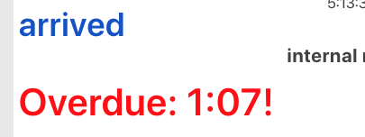

# Curbside Contact Manual

## Public DRAFT manual

## What is Curbside Contact?

Curbside Contact is a web application allowing business to interact with customers via SMS for the purposes of coordinating services when:

*   a customer is not able to come inside the building (during Covid19, maybe beyond)
*   the business wants an asynchronous way for many customers to be able to attend to this need, without further clogging what might be busy phone lines.

Customers will need to be informed of the phone number dedicated to this system, and educated that it is only for use with curbside communication.  This can be done over the phone in advance of arrival, with signage, etc.

This manual is divided into the User portion and the Admin section. The latter goes into more detail and configuration.

# User Manual

## Logging in

Open the site at from the URL provided by your administrator

You should see a login form along the lines of:

This is a group login which assumes shared computers in the workplace, so the email might be your point of contact, but you should have been given credentials to use.

## Customer Sessions

Each time a customer arrives, they will initiate a new conversation or "session".  Each customer is listed, identified only by the phone number they are messaging from. This number may or may not be the same as associated with your customer record or phone order, but should be the one of the person actually present at the business.

Each conversation has a current "status". When a customer first arrives, they get a standard status of **arrived** and are listed in the main conversations view. The parts of this view are introduced below and explained in more detail below.

Customers are listed in the order in which they arrived. The conversation thread captures further back and forth with timestamps, but does not affect the order that customers are listed in.

## Changing status and responding

When a customer messages on arrival - they will get an immediate response as configured.

Any subsequent message from the customer will be added to the conversation, and the status of the conversation will be set to **reply**.

Here a customer has replied "ok" to the welcome message. You can see the status of the conversation when a customer replied in the == part of the conversation thread (in this case, **arrived**). In this case, the system is configured to auto-reply back to any message confirming it was received.

When you want to act on a customer conversation you can change the status, reply to the customer or both.

This will add a line to the conversation thread.

For each response action - an internal note can be added.  This can be used for employee initials, or other notes intended for the team. This is not included in the customer reply - but is shown in the thread.

You should first type in any internal note, before choosing the status/action from the drop down menu.

Each status/action has a set of options and behaviors which are configured in settings.

**Response**: What message to send to the customer. If this is blank, no message is sent to the customer

**Update Immediately**: Whether the conversation should be updated as soon as the action is selected, or paused to allow a response to be edited (or deleted).

**Closes Session**: If a status has this option enabled, it will mark the conversation as ended, removing it from the active list.

How these are configured is up to the business/admin, and are shared by all users on the team.

For example, an "internal" status, could be configured to update immediately, but have no response, this will simply add whatever internal note had been typed to the conversation thread.

#### Example

a status called "custom" that updates immediately with no message to customer

Below, you can see that as soon as "custom" is selected, the internal note is added. You will see that the absence of any message to the customer is marked with three dashes **---** and the internal note is in brackets.

If a status is **not** configured as send immediately, you can edit the response before sending.

#### Example

Here the standard **reply** status was chosen. This reveals an edit box, where the pre-configured response can be edited before sending to the customer.  

Here is how the conversation thread looks after this response is sent, and the customer replies

## Ending Conversations

Once service is concluded with a customer, there are two ways to close out the conversation and remove it from the active list.

The fastest is to click the "done" button on the right hand side of a conversation

		✅

This will immediately close the conversation without sending any final reply. The exact same action can be done by choosing the "ended" status.

The admin may have created other statuses that will also close a conversation, perhaps sending a parting message to the customer. These should be documented and made clear within your team.

## Overdue Items

While the order of customers is listed by arrival, different customers may be in different states of process.

A deadline (current default of 2 min) is set to flag a conversation as overdue for attention if nobody on the team has responded by the deadline. The counter counts up showing how long overdue the interaction is.

Any update by the team will reset this timer, whether or not a response message is sent to the customer as part of that update.

## Showing/Hiding inactive conversations

Normally you only want to see active conversations (Customers that are present and being processed).

Sometimes you need to peek back at a recent conversation, perhaps re-open an accidentally closed conversation.

You can do this by clicking the monkey face in the top right:

        🙈

When the monkey is covering his eyes, he and you do not see inactive conversations

        🐵

 

When the eyes are open, the most recent 25 conversations are shown, and the order is reversed from the normal view (the most recent conversation is on the top).

